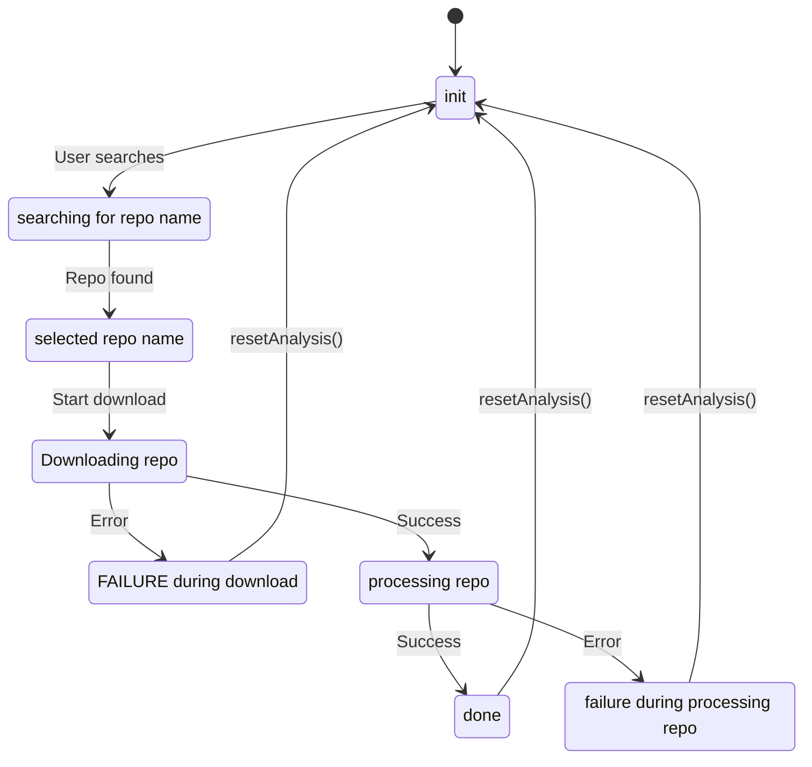

# GlobalState Diagram

Here is a state diagram representing the transitions for `GlobalState` as defined in `src/store/useStore.ts`:

```mermaid
stateDiagram-v2
    [*] --> init
    
    state "searching for repo name" as searching_for_repo_name
    state "selected repo name" as selected_repo_name
    state "Downloading repo" as Downloading_repo
    state "FAILURE during download" as FAILURE_during_download
    state "processing repo" as processing_repo
    state "failure during processing repo" as failure_during_processing_repo
    state "done" as done

    init --> searching_for_repo_name : User searches
    searching_for_repo_name --> selected_repo_name : Repo found
    selected_repo_name --> Downloading_repo : Start download
    
    Downloading_repo --> processing_repo : Success
    Downloading_repo --> FAILURE_during_download : Error
    
    processing_repo --> done : Success
    processing_repo --> failure_during_processing_repo : Error
    
    FAILURE_during_download --> init : resetAnalysis()
    failure_during_processing_repo --> init : resetAnalysis()
    done --> init : resetAnalysis()
```
